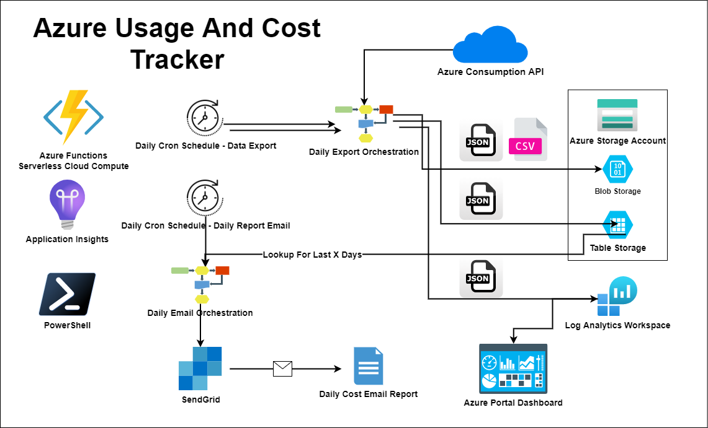
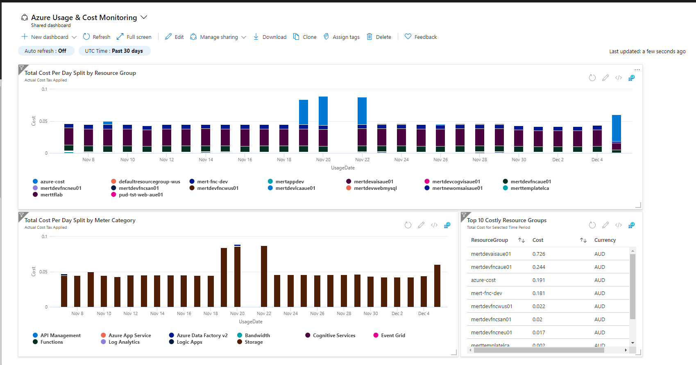
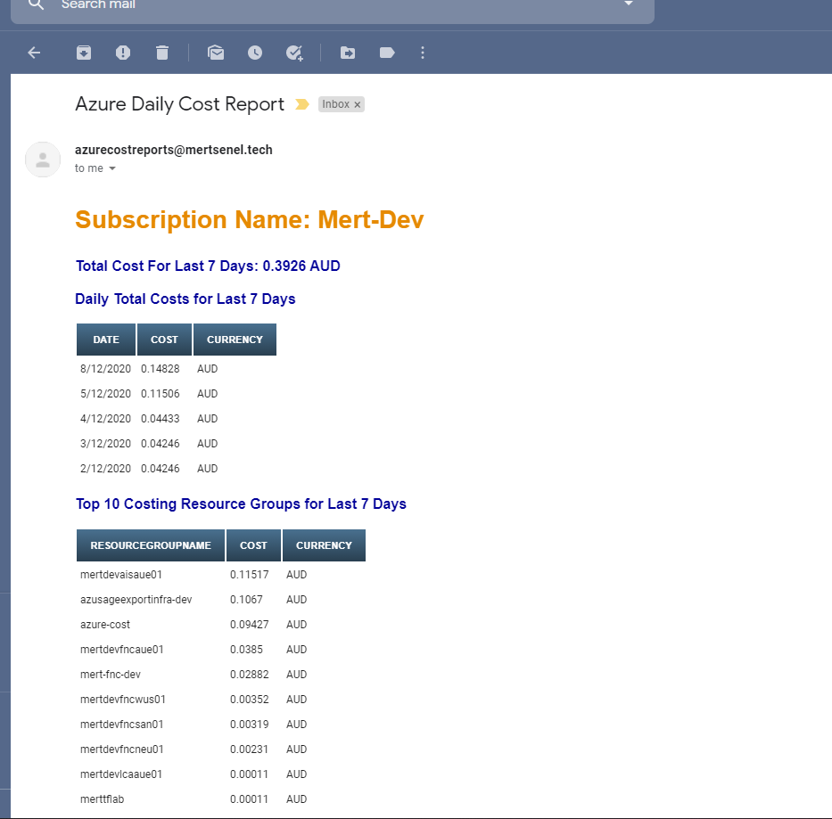
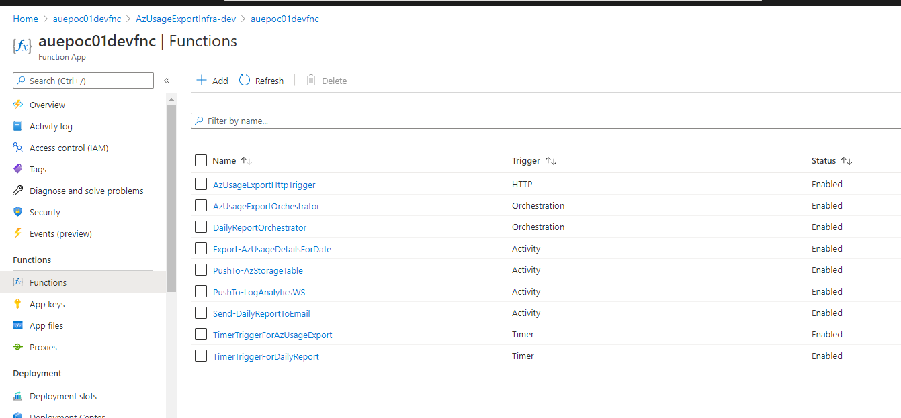
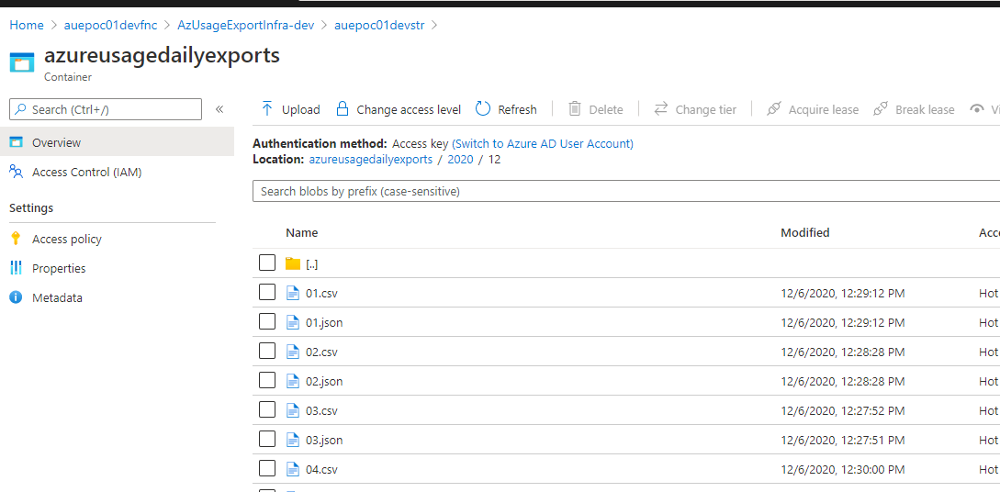
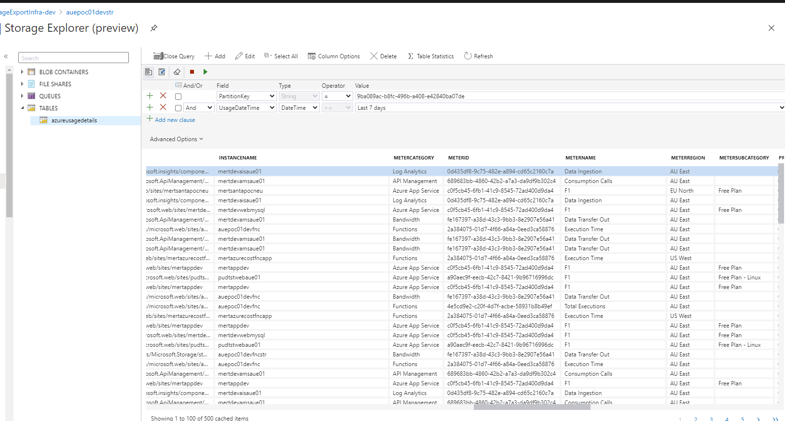
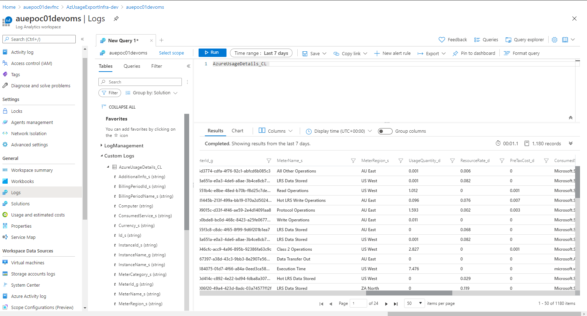
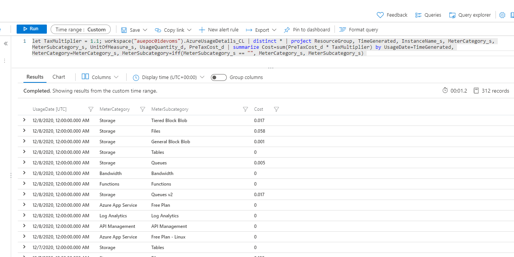

# Azure Native Usage & Cost Tracking

#### ScreenShots:

##### Azure Portal Dashboard:
A Dashboard that You can Extend & Customize

##### Sample Daily Email Report:
Get a glance of your last 7 days - Daily! not much later.
Detect Cost Spikes Sooner

##### Powered by Serverless Azure Durable Functions for PowerShell
Fully Powered by Azure Native Technologies

##### Better Blob Exports (both JSON & CSV) formats
Blobs are placed in logical YYYY/MM/ path structure with Day.ext format file names, easy to locate and run further ETLs. 

##### Azure Storage Table for Long Term Retention
Records will also be stored in a storage table for curating Daily Reports that covers last 7 days. In order to not hit limits of Azure Billing API, I only extract 1 or 2 days worth of data at a time and use table for retro lookups. 

##### Your Data Your Rules, Logs are also Pushed to a Log Analytics Workspace
This is the data backend for the Azure Portal Dashboard Charts. However, once your logs are here possibilities are endless.  

You can create Azure Workbooks, Azure Monitor Alerts or just run your custom queries to deep dive into your Azure usage data.  

#### Project Naming Legend
__Project Details__  
Project Name: Mert Senel Tech Azure Usage Export  
Project ShortCode: mstaue 

| Environments     |     Code       |
| ------------- |:-------------:|
| Development    | dev |
| Test      | tst      |
| Staging | stg      |
| Production | prd |

| Azure Resources     |     Code       |
| ------------- |:-------------:|
| Function App    | fnc  |
| Storage Account     | str      |
| Application Insights | ais      |
| Log Analytics Workspace | oms |
| Azure Portal Dashboard | dsh |
| Azure Sendgrid | sgd |

| Project Resources | Name          |
| ------------- |:-------------:|
| App Service Plan (Consumption/Serverless) | {projCode}{env}asp |
| Function App  | {projCode}{env}fnc |
| Function App Storage       | {projCode}{env}fncstr  |
| Azure Usage Exports Storage | {projCode}{env}str   |
| Application Insights  | {projCode}{env}ais |
| Log Analytics Workspace | {projCode}{env}oms|
| Azure Usage & Cost Monitoring Dashboard | {projCode}{env}dsh |
| Azure Sendgrid | {projCode}{env}sgd |

Resources Generated Example: 

